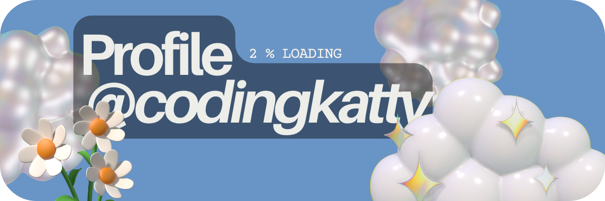

# 👋 Hello! I'm Candy

Welcome to my GitHub profile! I'm a student from Malaysia that has recently embarked on my coding journey. Coding is rlly fun and I love to code. I learned coding from my teacher, Khan Academy and Codedex <3

  

---

## 🌟 About Me
- 🔭 Made **Project Aries** with friend — a visualization tool for exoplanets and constellations. (NASA Space App Challenge 2024)
- 🎮 October: Participating in **Hacktoberfest**.
- 💡 Projects rn: The platform **Math4Python** for Hacktoberfest.
- 🚀 Always on the lookout for new ways to apply my coding skills to real-world problems.

---

## #30NitesOfCode:

  

---

### 🛠️ Technologies & Tools

---

### ✨ Random Dev Quote

---

### 📫 Social Media & more
- Website: [candyisacat.co](https://www.candyisacat.co)
- Twitter: [@LimYing86430](https://x.com/LimYing86340)

<!--
**codingkatty/codingkatty** is a ✨ _special_ ✨ repository because its `README.md` (this file) appears on your GitHub profile.

Here are some ideas to get you started:

- 🔭 I’m currently working on ...
- 🌱 I’m currently learning ...
- 👯 I’m looking to collaborate on ...
- 🤔 I’m looking for help with ...
- 💬 Ask me about ...
- 📫 How to reach me: ...
- 😄 Pronouns: ...
- ⚡ Fun fact: ...
-->
